# Real-Time Collaborative Whiteboard

A full-stack collaborative whiteboard for teams to sketch ideas, manage shared boards, and communicate in real time. Users can sign up, create boards, invite teammates, assign access levels, draw together on a live canvas, and chat inside the same workspace.

The frontend is built with React, Vite, Tailwind CSS, and Konva.js. It connects to a Spring Boot backend that handles authentication, board management, role-based permissions, chat, persistence, and WebSocket/STOMP synchronization.

## Live Demo

| Service | Link |
| --- | --- |
| Frontend | [https://real-time-whiteboard-pearl.vercel.app/](https://real-time-whiteboard-pearl.vercel.app/) |
| Backend | [https://real-time-whiteboard-backend-1.onrender.com](https://real-time-whiteboard-backend-1.onrender.com) |

## Repositories

| Repository | Link |
| --- | --- |
| Frontend | [https://github.com/ksaini-web/real-time-whiteboard](https://github.com/ksaini-web/real-time-whiteboard) |
| Backend | [https://github.com/ksaini-web/real-time-whiteboard-backend.git](https://github.com/ksaini-web/real-time-whiteboard-backend.git) |

## Highlights

- Real-time collaborative drawing across multiple connected users
- Live board chat for in-context team discussions
- Secure JWT-based authentication
- Role-based access control with Owner, Editor, and Viewer permissions
- Board invitations and permission management
- Undo and redo support for drawing actions
- WebSocket/STOMP synchronization for drawing and chat events
- Chat enable/disable control for board owners
- Responsive interface for desktop and tablet workflows
- Canvas drawing powered by Konva.js and React Konva

## Tech Stack

### Frontend

| Technology | Purpose |
| --- | --- |
| React | Frontend UI |
| Vite | Development server and production build tool |
| Tailwind CSS | Styling and responsive layout |
| Konva.js / React Konva | Canvas drawing and shape rendering |
| STOMP.js | WebSocket messaging client |
| SockJS | WebSocket fallback support |
| Axios | REST API requests |
| React Router | Client-side routing |
| Vercel | Frontend deployment |

### Backend

| Technology | Purpose |
| --- | --- |
| Spring Boot | REST API and backend application layer |
| Spring Security | Authentication and authorization |
| JWT | Stateless session security |
| WebSocket/STOMP | Real-time drawing and chat updates |
| MySQL | Relational data storage |
| Render | Backend deployment |

## Core Features

### Collaborative Whiteboard

Users can draw and update shapes on a shared canvas while other connected users see changes in real time. Shape data is persisted through the backend, so boards can be reopened with their saved content.

### Board Chat

Each board includes live chat so collaborators can discuss ideas without leaving the workspace. Owners can enable or disable chat based on the board's needs.

### Invitations and Permissions

Board owners can invite users by email and assign access levels. Invited users can accept pending invitations and join boards with the permissions granted to them.

### Undo and Redo

Drawing actions support undo and redo, helping users quickly correct changes during active collaboration.

## Role-Based Access Control

The application uses three board-level roles to keep collaboration controlled and predictable.

| Role | Permissions |
| --- | --- |
| Owner | Create and delete boards, invite users, manage permissions, enable or disable chat, draw, edit, and collaborate in real time |
| Editor | Draw and edit shapes, modify board content, collaborate in real time, and use chat |
| Viewer | View live board activity and participate in chat, but cannot draw or edit shapes |

### Owner

Owners have full control over their boards. They can invite collaborators, manage access, delete boards, control chat availability, and edit the canvas.

### Editor

Editors can actively contribute to the whiteboard. They can draw, update board content, and participate in real-time collaboration and chat.

### Viewer

Viewers can follow board activity live and participate in chat, but their board access is read-only for drawing content.

## WebSocket Architecture

The frontend connects to the backend WebSocket endpoint using SockJS and STOMP. Drawing and chat actions are published to application destinations, processed by the Spring Boot backend, and broadcast to subscribed clients.

When a user creates, updates, deletes, undoes, or redoes a shape, the frontend sends the event to the backend. The backend then broadcasts the update so every connected user stays synchronized on the same board.

Chat messages use the same real-time flow, allowing board members to communicate instantly while drawing.

### Main Real-Time Events

- Shape created
- Shape updated
- Shape deleted
- Undo or redo action
- Chat message sent
- Board chat enabled or disabled

### WebSocket Routes

| Purpose | Route |
| --- | --- |
| WebSocket endpoint | `/ws` |
| Send drawing updates | `/app/draw` |
| Receive drawing updates | `/topic/shapes` |
| Send chat messages | `/app/chat` |
| Receive global chat messages | `/topic/chat` |
| Receive board chat messages | `/topic/board/{boardId}/chat` |

## Screenshots

### Login

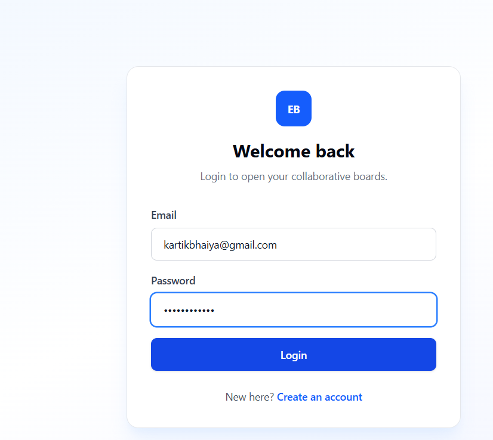

### Signup

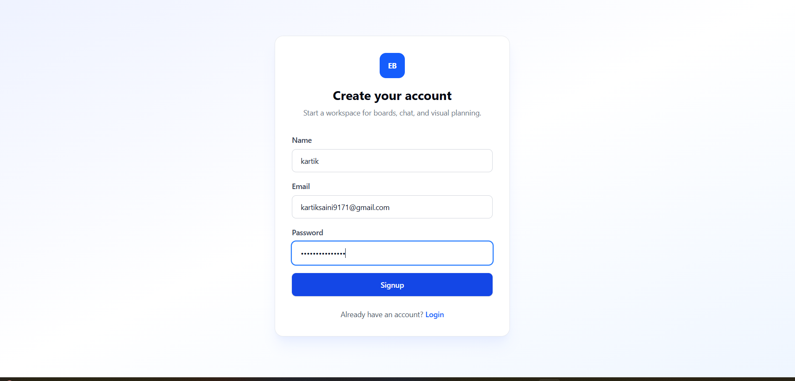

### Dashboard

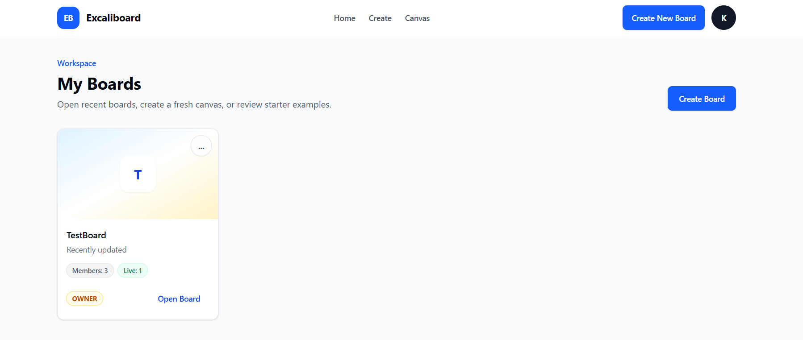


### Invitation System


### Access Roles

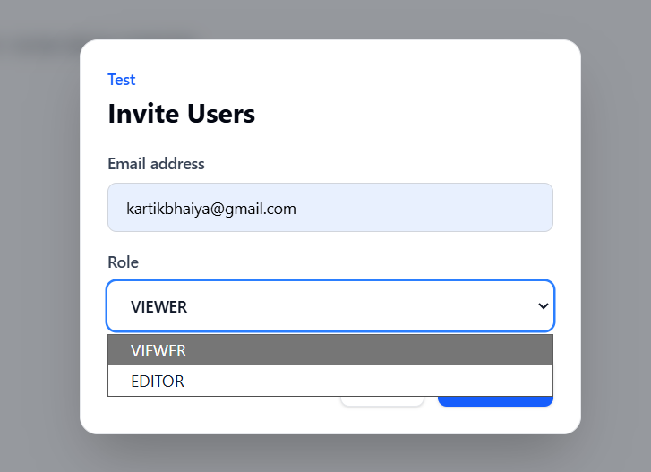

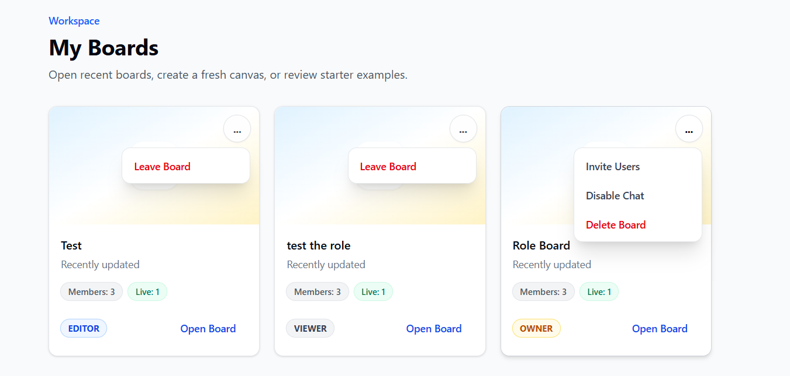

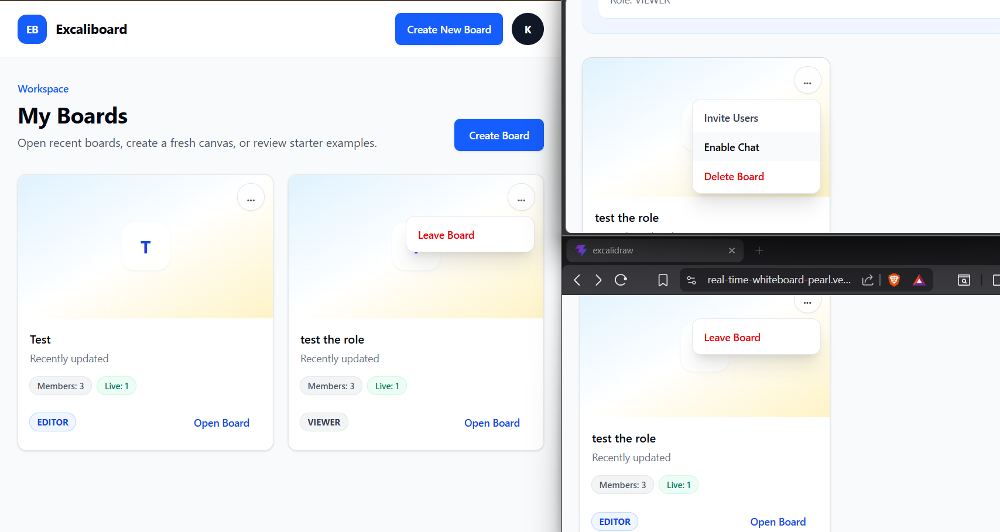

### Owner Workflow

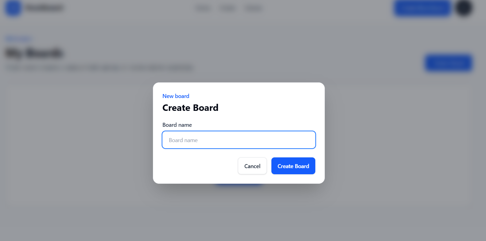

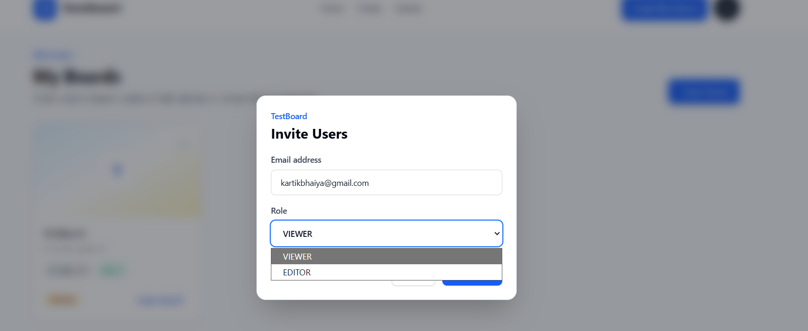

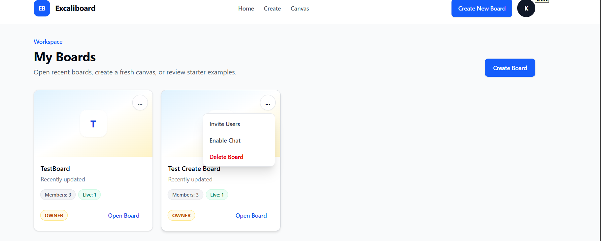

### Editor Board

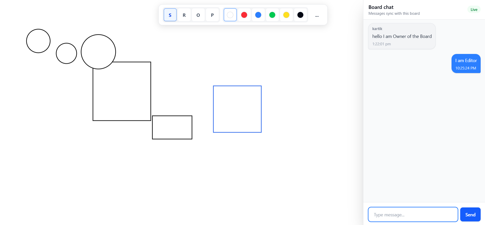

### Viewer Board

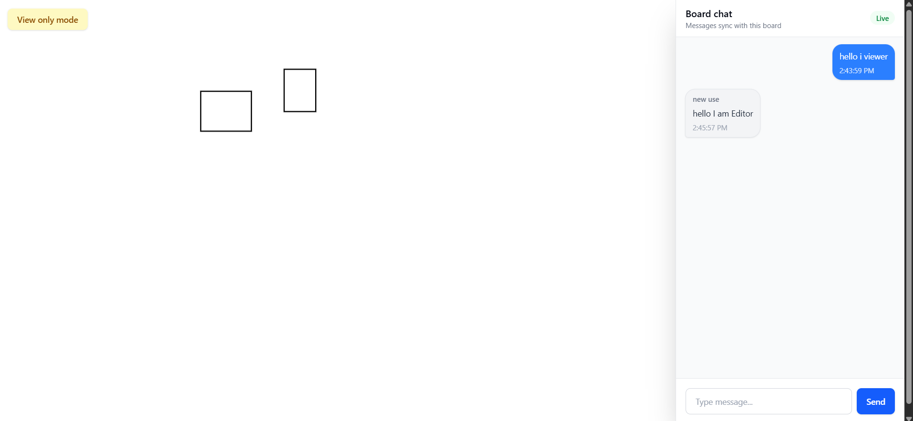

## Getting Started

### Prerequisites

Before running the frontend locally, make sure you have:

- Node.js 18 or higher
- npm
- Git
- A running instance of the Spring Boot backend

### Clone the Repository

```bash
git clone https://github.com/ksaini-web/real-time-whiteboard.git
cd real-time-whiteboard
```

### Install Dependencies

```bash
npm install
```

### Configure Environment Variables

Create a `.env` file in the project root:

```powershell
New-Item -ItemType File .env
```

Add the backend API URL:

```env
VITE_BACKEND_URL=http://localhost:8080
```

### Run the Frontend

```bash
npm run dev
```

The application will be available at:

```text
http://localhost:5173
```

### Build for Production

```bash
npm run build
```

### Preview the Production Build

```bash
npm run preview
```

## Backend Setup Requirement

This frontend requires the Spring Boot backend for authentication, board APIs, permissions, chat, shape persistence, and real-time synchronization.

Backend repository:

```text
https://github.com/ksaini-web/real-time-whiteboard-backend.git
```

For local development, run the backend on:

```text
http://localhost:8080
```

The backend should provide:

- User signup and login APIs
- JWT authentication
- Board creation and management APIs
- Invitation and permission APIs
- Shape storage APIs
- Undo and redo action APIs
- WebSocket/STOMP endpoints
- MySQL database connection

## Problem Statement

Remote teams often need a simple place to brainstorm visually and communicate at the same time. Many whiteboard tools are either limited, expensive, or difficult to customize for a specific workflow.

Real-Time Collaborative Whiteboard solves this by combining authentication, board access control, collaborative drawing, live chat, and board management in one full-stack project.

## Future Improvements

- Export boards as PNG or PDF
- Add sticky notes and text annotations
- Show live user cursors
- Add board templates
- Improve mobile touch drawing
- Add board activity history
- Add OAuth login with Google or GitHub
- Add more advanced shape styling options
- Add notifications for board invitations

## Author

**Kartik Saini**

- GitHub: [@ksaini-web](https://github.com/ksaini-web)
- Frontend Demo: [https://real-time-whiteboard-pearl.vercel.app/](https://real-time-whiteboard-pearl.vercel.app/)
- Backend Demo: [https://real-time-whiteboard-backend-1.onrender.com](https://real-time-whiteboard-backend-1.onrender.com)
